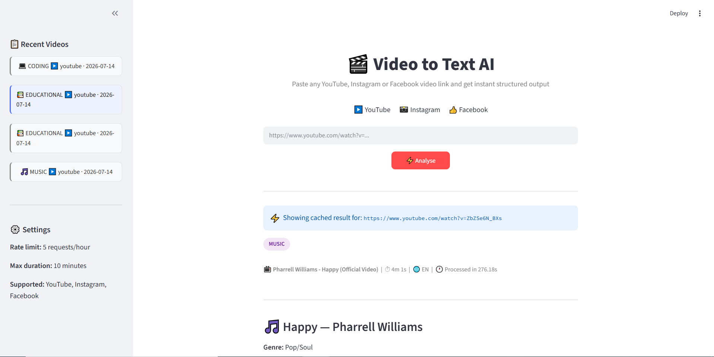
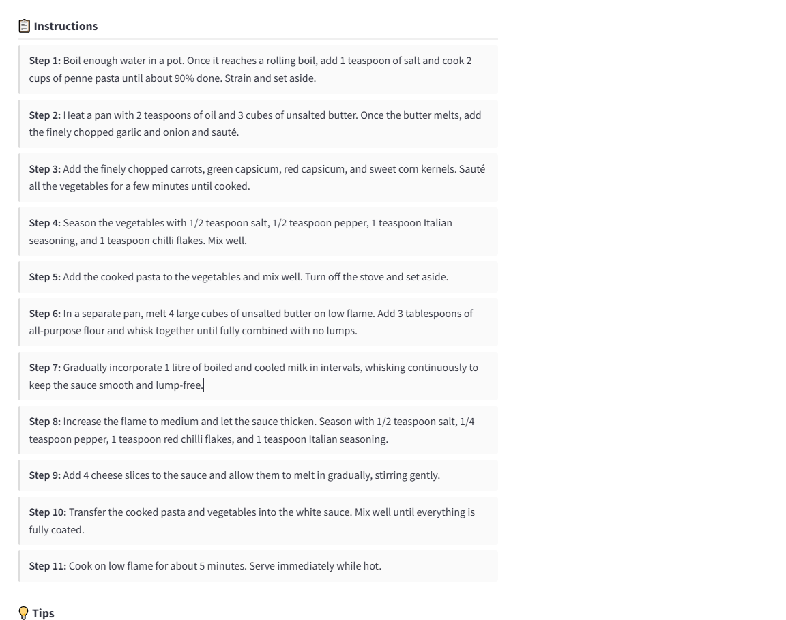

# 🎬 Video to Text AI

An AI-powered tool that converts YouTube, Instagram, and Facebook videos into structured, 
readable content — automatically detecting content type and formatting output accordingly.

## ✨ Features

- 🎙️ **Speech-to-text** transcription using OpenAI Whisper (runs locally, free)
- 🧠 **Smart content classification** — recipe, coding, educational, music, or general
- 📋 **Type-aware output** — recipe cards, code guides, study notes, lyrics, summaries
- ⚡ **Caching** — same URL processed instantly on repeat requests
- 🛡️ **Guardrails** — rate limiting, URL sanitization, duration limits, transcript quality checks
- 📊 **Request logging** — full audit trail of all processed videos

## 🗂️ Content Types & Outputs

| Video Type | Output Format |
|---|---|
| 🍳 Recipe/Cooking | Ingredients list + step-by-step instructions |
| 💻 Coding Tutorial | Tech stack + steps + code blocks + key concepts |
| 📚 Educational | Concise summary + key points + detailed notes + terms |
| 🎵 Music Video | Song title + artist + genre + reconstructed lyrics |
| 🎯 General | Summary + highlights + topics + sentiment |

## 🏗️ Architecture

Video URL → Guardrails → yt-dlp → ffmpeg → Whisper → Claude (classify) → Claude (summarize) → Streamlit UI

## 🛠️ Tech Stack

- **Backend:** FastAPI (Python)
- **Frontend:** Streamlit
- **Transcription:** OpenAI Whisper (local)
- **AI Summarization:** Claude claude-sonnet-4-6 (Anthropic)
- **Audio Processing:** yt-dlp + ffmpeg

## 📸 Screenshots

### Home


### Coding Tutorial Output


### Educational Video Output


### Music Video Output


### Cooking Video Output



### History Sidebar


## 🚀 Setup & Run

### 1. Clone and install
```bash
git clone <your-repo>
cd video-to-text
python -m venv venv
venv\Scripts\activate        # Windows
pip install -r requirements.txt
```

### 2. Set environment variables
Create a `.env` file:
ANTHROPIC_API_KEY=sk-ant-xxxxxxxxxxxxxxxx

### 3. Run
```bash
# Terminal 1 — Backend
uvicorn app.main:app --reload

# Terminal 2 — Frontend
streamlit run streamlit_app.py
```

Open 👉 http://localhost:8501

## 🛡️ Guardrails

| Guardrail | Limit |
|---|---|
| Rate limit | 5 requests per hour per IP |
| Max video duration | 10 minutes |
| Supported platforms | YouTube, Instagram, Facebook |
| Silent video detection | Rejects videos with no speech |
| URL sanitization | Strips tracking parameters |

## 📁 Project Structure
video-to-text/

├── app/

│   ├── main.py              ← FastAPI app

│   ├── config.py            ← Settings

│   └── services/

│       ├── link_validator.py

│       ├── audio_extractor.py

│       ├── transcriber.py

│       ├── classifier.py

│       ├── summarizer.py

│       └── guardrails.py

├── streamlit_app.py         ← Streamlit UI

├── outputs/

│   ├── audio/               ← Downloaded audio files

│   ├── cache/               ← Cached results

│   └── logs/                ← Request logs

└── requirements.txt